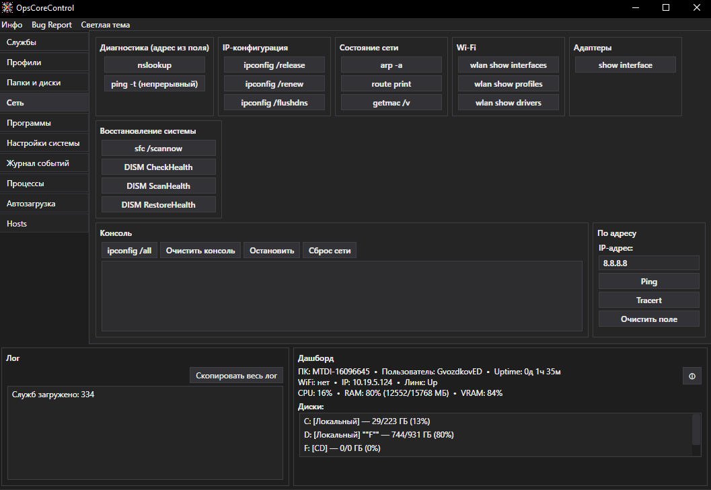

# OpsCoreControl

Десктопная утилита для системного администратора и техподдержки на WPF.
Собирает в одном окне то, ради чего обычно открывают десяток оснасток:
службы, процессы, автозагрузку, сетевую диагностику, журналы событий,
диски, профили пользователей и настройки системы.

> Приложение требует прав администратора (UAC) — без них часть функций
> (службы, реестр HKLM, сброс сети, файл подкачки) работать не будет.

## Возможности

- **Службы** — список, старт/стоп/рестарт, смена типа запуска; перезапуск
  Print Spooler; перезагрузка и выключение ПК (с подтверждением); быстрый
  запуск системных оснасток.
- **Профили** — просмотр профилей пользователей и удаление выбранных.
- **Папки и диски** — очистка «Загрузок» и Temp; открытие сетевых папок и
  подключение их как дисков; проверка здоровья дисков (SMART); отключение
  и переименование дисков.
- **Сеть** — nslookup, ping, tracert, arp, route, getmac; команды ipconfig
  (release/renew/flushdns/all); состояние Wi-Fi и адаптеров; сброс сети;
  восстановление системы (sfc /scannow, DISM CheckHealth/ScanHealth/RestoreHealth).
- **Программы** — установка CryptoPro, CryptoPro Plugin, Cisco AnyConnect и Assistant из встроенных установщиков; список
  установленных программ с поиском и удалением.
- **Настройки системы** — таймер блокировки экрана; яркость монитора
  (ноутбуки); управление файлом подкачки (размер, очистка, «по выбору системы»).
- **Журнал событий** — чтение System/Application с фильтром по типу и описанием.
- **Процессы** — список с поиском по имени и PID, завершение процесса.
- **Автозагрузка** — список программ с включением/выключением (как в Диспетчере задач).
- **Hosts** — просмотр файла hosts и открытие его папки для правки.
- **Дашборд** — CPU, RAM, VRAM, диски, сеть, Wi-Fi, USB, батарея, uptime;
  краткая и расширенная зоны.
- **Два интерфейса** — классический и современный режимы с сохранением выбора.
- **Светлая и тёмная темы** — переключаются из меню и работают в обоих интерфейсах.
- **Журналирование** — ежедневный файл журнала, ограничение размера и удаление записей старше 30 дней.
- **Глобальный обработчик исключений** — приложение не падает молча,
  ошибки пишутся в лог.

## Скриншот

## Требования

- Windows 10 / 11 (x64).
- .NET Framework 4.7.2 или новее.
- Права администратора.

## Установка и запуск

1. Скачай последнюю сборку из [Releases](https://github.com/rmUmind/OpsCoreControl/releases).
2. Распакуй архив в любую папку.
3. Запусти `OpsCoreControl.exe` — при старте Windows запросит права
   администратора (UAC), подтверди.

> Если собираешь из исходников: открой решение в Visual Studio 2022,
> выбери конфигурацию **Release** и собери (Ctrl+Shift+B). Исполняемый
> файл появится в `bin\Release`.

## Структура проекта

Логика вынесена в менеджеры (папка `WorkingClasses`), интерфейс разбит
на partial-классы главного окна по вкладкам:

| Файл | За что отвечает |
|---|---|
| `ServiceManager` | службы, перезагрузка/выключение, запуск процессов |
| `FileSystemManager` | очистка папок, диски, SMART, файл подкачки |
| `NetworkManager` | сетевые диски, сброс сети |
| `SoftwareManager` | установленные программы, установщики, скачивание |
| `ProcessManager` | список и завершение процессов |
| `StartupManager` | автозагрузка |
| `UserProfileManager` | профили пользователей |
| `SystemSettingsManager` | блокировка экрана |
| `PhysicalMonitorBrightnessController` | яркость монитора (ноутбуки) |
| `EventLogManager` | журнал событий |
| `HostsManager` | файл hosts |
| `DashBoard` | сбор данных для панели мониторинга |

## Отчёт об ошибке

Нашёл баг или есть идея — создай [issue](https://github.com/rmUmind/OpsCoreControl/issues).
Приложи описание шагов и, если есть, лог из окна приложения.

## Лицензия

Проект распространяется под лицензией MIT. Подробнее — в файле [LICENSE](LICENSE).

## Автор

Разработал [rmUmind](https://github.com/rmUmind).
